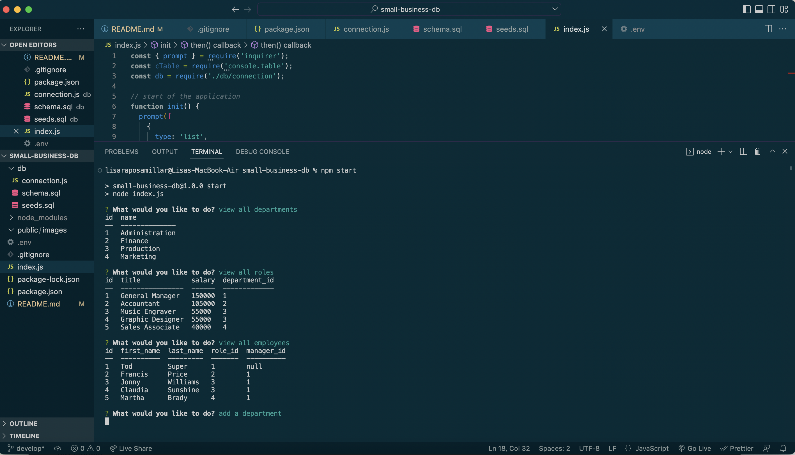

# Small Business DB

###  

  ## Table of Contents
  - [Description](#description)
  - [Installation](#installation)
  - [Usage](#usage)
  - [Contributing](#contributing)
  - [Tests](#tests)
  - [Questions](#questions)
  - [License](#license)

  ## Description 
  Small Business DB assists entrepreneurs with data tracking by including tables and definitions for departments, roles, and employees. This application is in-progress. <a href="https://drive.google.com/file/d/1R2N3VFLyq0rYReX1Yi4MyW4OWqgCTJDH/view?usp=sharing">Walkthrough Video Link</a>  
  N.B.: Bootcamp study project
  
  ## Installation 
   1. Node.js (npm init) 2. npm i inquirer@8.2.4 3. npm i mysql2@2.3.3 4. npm i console.table@0.10.0 5. npm i dotenv@16.0.3
  
  ## Usage
  npm start 

  ## Contributing 
  Developers who have ideas for improvement may fork this project and submit pull requests for review.

  ## Tests
  n/a

  ## Questions 
  Please feel free to reach out via either of the links below if you have additional questions about this application. 
  GitHub: <a href="https://github.com/raposamillar/">raposamillar</a> 
  Email: lisa.raposamillar@gmail.com

  ## License
  ### This application is covered under the [GPL v3.0](https://choosealicense.com/licenses/gpl-3.0/) license.

  
  